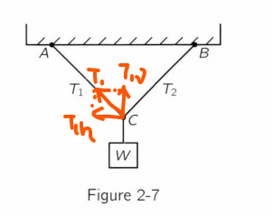

# Solutions

### 2.9
The answer is $25\sqrt{2}$.

Looking at the point C. It is acted by a force of $50 lb$ (the weight of W) through the downward wire. The force should be cancelled by the force $F_{AC}$ and $F_{BC}$. From the shape of triangle ABC we know that the slope of each $AC$ (and $BC$) is $45^{\circ}$ (and also they are symmetric). Therefore $T_1$ (and $T_2) should be equal to $\sqrt 2$ times of its vertical component, which in turn is half of $50 lb$. Therefore the answer is $25\sqrt{2}$.
